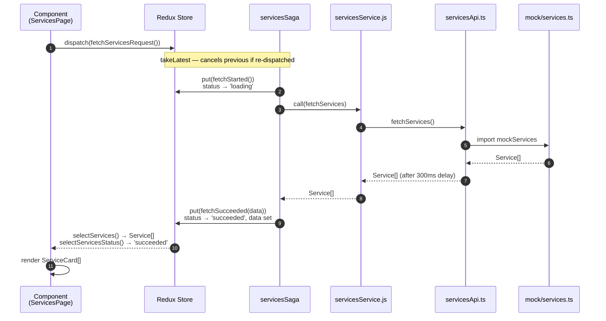
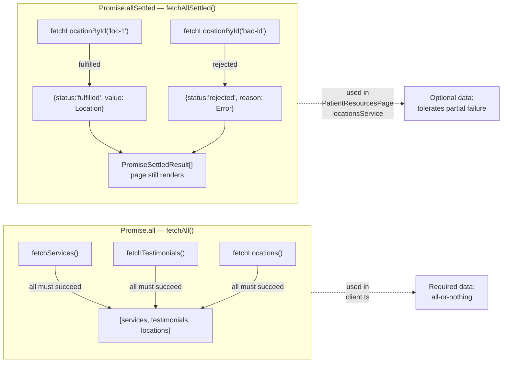

# CORA Physical Therapy — Application Architecture

## Application Flowchart

```mermaid
flowchart TD
    %% ─────────────────────────────────────────
    %% ENTRY
    %% ─────────────────────────────────────────
    subgraph ENTRY["Entry Point"]
        IDX["index.html"]
        MAIN["main.jsx\nReact.StrictMode"]
        SP["StoreProvider\n(Redux Provider)"]
        APP["App.jsx\nBrowserRouter + Routes"]
        IDX --> MAIN --> SP --> APP
    end

    %% ─────────────────────────────────────────
    %% ROUTING — lazy loaded pages
    %% ─────────────────────────────────────────
    APP -->|"React.lazy + Suspense\n↓ PageSkeleton while loading"| PAGES

    subgraph PAGES["Pages (Route-level code splitting)"]
        direction LR
        PH["/ HomePage"]
        PA["'/about' AboutPage\n+ withErrorBoundary HOC"]
        PS["'/services' ServicesPage"]
        PL["'/locations' LocationsPage"]
        PR["'/patient-resources'\nPatientResourcesPage"]
        PC["'/contact' ContactPage"]
    end

    %% ─────────────────────────────────────────
    %% SHARED LAYOUT SHELL
    %% ─────────────────────────────────────────
    PAGES -->|"every page renders"| LAYOUT

    subgraph LAYOUT["PageLayout (shared shell)"]
        direction TB
        ABC["AnnouncementBarConnected"]
        HDR["Header\n(react-router Link)"]
        FTR["Footer\n(react-router Link)"]
        MAIN_SLOT["&lt;main&gt; children slot"]
        ABC --> HDR --> MAIN_SLOT --> FTR
    end

    %% ─────────────────────────────────────────
    %% HOC
    %% ─────────────────────────────────────────
    PA -->|"wrapped by"| HOC

    subgraph HOC["withErrorBoundary HOC\n(hocs/withErrorBoundary.tsx)"]
        EB["ErrorBoundary class\ngetDerivedStateFromError"]
        FB["Default fallback UI\n'Something went wrong'"]
        CBK["onError callback\n(Sentry-ready)"]
        EB -->|"hasError = true"| FB
        EB --> CBK
    end

    %% ─────────────────────────────────────────
    %% SECTIONS used by HomePage
    %% ─────────────────────────────────────────
    PH --> SECTIONS

    subgraph SECTIONS["HomePage Sections"]
        direction LR
        S1["Hero"]
        S2["PainGrid"]
        S3["LocationFinder\n(reads locationSlice)"]
        S4["CareerSection"]
        S5["ReferralSection"]
        S6["Testimonials\n(reads testimonialsSlice)"]
        S7["NewsSection"]
    end

    %% ─────────────────────────────────────────
    %% CUSTOM HOOKS
    %% ─────────────────────────────────────────
    PS -->|"useFetch (idle guard)"| HOOKS
    PL -->|"useDebounce (search)"| HOOKS
    PR -->|"useFetch"| HOOKS

    subgraph HOOKS["Custom Hooks (src/hooks/)"]
        direction TB
        HF["useFetch&lt;T&gt;\nuseState + useEffect\nuseCallback + useRef\n(mounted guard + refetch)"]
        HD["useDebounce&lt;T&gt;\nuseState + useEffect\n(clearTimeout on change)"]
        HL["useLocalStorage&lt;T&gt;\nuseState + useCallback\n(graceful quota fallback)"]
    end

    %% ─────────────────────────────────────────
    %% REDUX STORE
    %% ─────────────────────────────────────────
    PS -->|"dispatch fetchServicesRequest\nselect services"| STORE
    PL -->|"dispatch fetchLocationsRequest\nselect locationsData"| STORE
    S3 -->|"reads/writes locationSlice"| STORE
    S6 -->|"reads/writes testimonialsSlice"| STORE
    ABC -->|"reads/writes uiSlice"| STORE

    subgraph STORE["Redux Store (store/index.js)\n+ sagaMiddleware"]
        direction TB

        subgraph SLICES["Slices"]
            direction LR
            SL_SVC["servicesSlice\ndata / status / error"]
            SL_LOC["locationsDataSlice\ndata / status / error"]
            SL_SRCH["locationSlice\nquery / radius / UI"]
            SL_TEST["testimonialsSlice\nactiveIndex"]
            SL_UI["uiSlice\nannouncementVisible"]
        end

        subgraph SAGAS["Sagas (takeLatest)"]
            direction LR
            ROOT["rootSaga\nall(...)"]
            SG_SVC["servicesSaga\nwatchServices"]
            SG_LOC["locationsSaga\nwatchLocations"]
            ROOT --> SG_SVC & SG_LOC
        end

        SG_SVC -->|"fetchStarted → call → fetchSucceeded\nor fetchFailed"| SL_SVC
        SG_LOC -->|"fetchStarted → call → fetchSucceeded\nor fetchFailed"| SL_LOC
    end

    %% ─────────────────────────────────────────
    %% SERVICES LAYER
    %% ─────────────────────────────────────────
    SG_SVC -->|"call fetchServices()"| SERVICES
    SG_LOC -->|"call fetchLocations()"| SERVICES
    PR -->|"fetchAllSettled via useFetch"| SERVICES

    subgraph SERVICES["Service Layer (src/services/)"]
        direction TB

        subgraph JS_SVC["JS Wrappers (saga-facing)"]
            SVC_S["servicesService.js"]
            SVC_L["locationsService.js\n+ fetchLocationsByIds\n(Promise.allSettled)"]
        end

        subgraph TS_SVC["TS API Layer (services/api/)"]
            direction LR
            CLI["client.ts\nAxios wrapper\nretry + back-off\nfetchAll / fetchAllSettled"]
            API_S["servicesApi.ts\nfetchServices()\nfetchServiceBySlug()"]
            API_L["locationsApi.ts\nfetchLocations()\nfetchLocationById()\nfetchLocationsByIds()"]
        end

        SVC_S --> API_S
        SVC_L --> API_L
        CLI -.->|"utility used by\nPatientResourcesPage"| API_L
    end

    %% ─────────────────────────────────────────
    %% MOCK DATA
    %% ─────────────────────────────────────────
    SERVICES --> DATA

    subgraph DATA["Mock Data (src/data/)"]
        direction LR
        D_SVC["mock/services.ts\nService[]"]
        D_LOC["mock/locations.ts\nLocation[]"]
        D_NAV["navigation.js\nprimaryNav / utilityNav\nfooterLinks / socialLinks"]
        D_TEST["testimonials.js"]
        D_NEWS["news.js"]
        D_PAIN["painAreas.js"]
    end

    API_S --> D_SVC
    API_L --> D_LOC
    HDR --> D_NAV
    FTR --> D_NAV
    S6 --> D_TEST
    S7 --> D_NEWS
    S2 --> D_PAIN

    %% ─────────────────────────────────────────
    %% UI PRIMITIVES
    %% ─────────────────────────────────────────
    LAYOUT --> UI_PRIMS
    PAGES --> UI_PRIMS

    subgraph UI_PRIMS["UI Primitives (components/ui/)"]
        direction LR
        UB["Button"]
        UI["Input"]
        UC["Container"]
        USH["SectionHeading\n(eyebrow / title / subtitle)"]
        UPH["PageHero\n(title / subtitle / cta)"]
        UPS["PageSkeleton\n(Suspense fallback)"]
        USS["Select"]
        UTA["TriangleAccent"]
    end

    %% ─────────────────────────────────────────
    %% STYLES
    %% ─────────────────────────────────────────
    UI_PRIMS -. "Tailwind CSS v4\ncora-navy / cora-blue\ncora-orange / cora-sky" .-> CSS["index.css\ntheme tokens"]

    %% ─────────────────────────────────────────
    %% STYLES
    %% ─────────────────────────────────────────
    classDef page        fill:#0072bc,color:#fff,stroke:none
    classDef hook        fill:#00a9e0,color:#fff,stroke:none
    classDef store       fill:#0c3d6e,color:#fff,stroke:none
    classDef service     fill:#f57c00,color:#fff,stroke:none
    classDef data        fill:#e8f4fa,color:#0c3d6e,stroke:#0072bc
    classDef ui          fill:#f5f8fa,color:#0c3d6e,stroke:#00a9e0
    classDef hoc         fill:#5a6a7a,color:#fff,stroke:none
    classDef entry       fill:#0c3d6e,color:#fff,stroke:none

    class PH,PA,PS,PL,PR,PC page
    class HF,HD,HL hook
    class SL_SVC,SL_LOC,SL_SRCH,SL_TEST,SL_UI,SG_SVC,SG_LOC,ROOT store
    class SVC_S,SVC_L,CLI,API_S,API_L service
    class D_SVC,D_LOC,D_NAV,D_TEST,D_NEWS,D_PAIN data
    class UB,UI,UC,USH,UPH,UPS,USS,UTA ui
    class HOC,EB,FB,CBK hoc
    class IDX,MAIN,SP,APP entry
```

---

## Data-Flow Diagram (Async API Path)

```mermaid
sequenceDiagram
    autonumber
    participant C  as Component<br/>(ServicesPage)
    participant RS as Redux Store
    participant SA as servicesSaga
    participant SV as servicesService.js
    participant API as servicesApi.ts
    participant MD as mock/services.ts

    C->>RS: dispatch(fetchServicesRequest())
    Note over RS,SA: takeLatest — cancels previous if re-dispatched

    SA->>RS: put(fetchStarted())<br/>status → 'loading'
    SA->>SV: call(fetchServices)
    SV->>API: fetchServices()
    API->>MD: import mockServices
    MD-->>API: Service[]
    API-->>SV: Service[] (after 300ms delay)
    SV-->>SA: Service[]

    SA->>RS: put(fetchSucceeded(data))<br/>status → 'succeeded', data set

    RS-->>C: selectServices() → Service[]<br/>selectServicesStatus() → 'succeeded'
    C->>C: render ServiceCard[]
```

---

## Promise Patterns Diagram

```mermaid
flowchart LR
    subgraph PA["Promise.all — fetchAll()"]
        direction TB
        P1A["fetchServices()"] & P2A["fetchTestimonials()"] & P3A["fetchLocations()"]
        P1A & P2A & P3A -->|"all must succeed"| RALL["[services, testimonials, locations]"]
    end

    subgraph PAS["Promise.allSettled — fetchAllSettled()"]
        direction TB
        P1S["fetchLocationById('loc-1')"] & P2S["fetchLocationById('bad-id')"]
        P1S -->|"fulfilled"| R1["{status:'fulfilled', value: Location}"]
        P2S -->|"rejected"| R2["{status:'rejected', reason: Error}"]
        R1 & R2 --> RSET["PromiseSettledResult[]<br/>page still renders"]
    end

    PA -.->|"used in\nclient.ts"| NOTE1["Required data:\nall-or-nothing"]
    PAS -.->|"used in\nPatientResourcesPage\nlocationsService"| NOTE2["Optional data:\ntolerates partial failure"]
```
